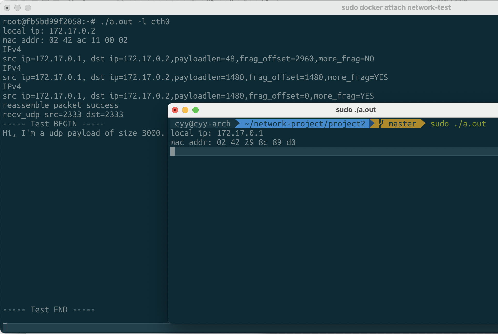
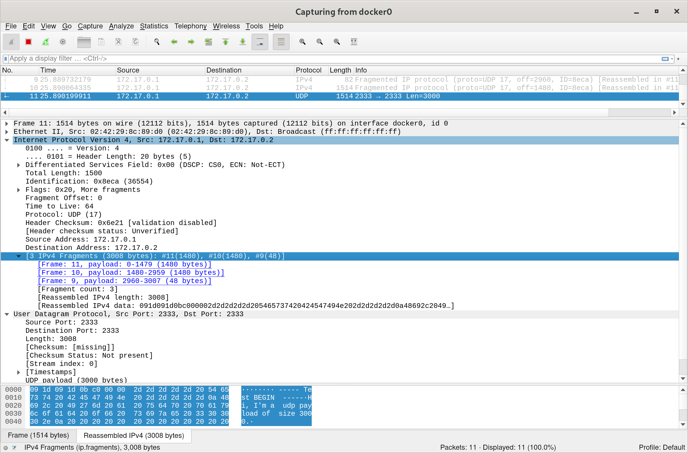

# 计算机网络Project 2

1. 实现功能
   1. [x] L2: 以太网封装
   2. [x] L3: IPv4封装
   3. [x] L3: IPv4分片
   4. [x] L4: UDP收发

2. 效果演示：

   - 发送端直接在Arch Linux上运行

   - 接收端运行在主机的Arch Linux上的Docker中的Debian

   - 效果展示：

     

   - Wireshark抓包结果：

     