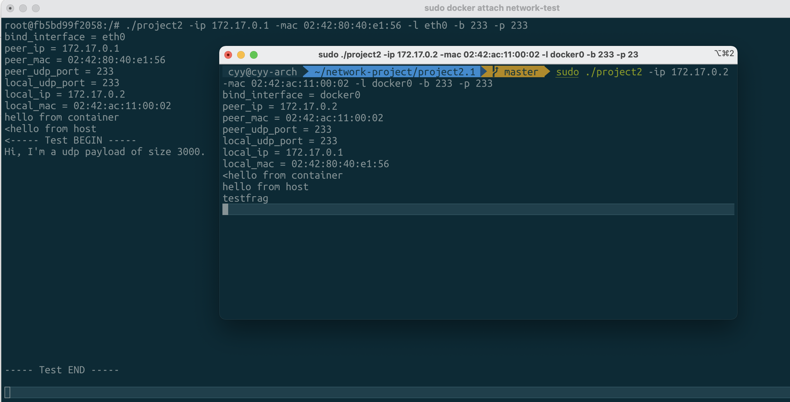

# 计算机网络Project 2

## 实现功能

1. L2: 以太网封装
2. L3: IPv4封装
3. L3: IPv4分片
4. L4: UDP收发

## 设计思路

该Project设计上分为6步走，分别是：

1. Linux下`PF_PACKET`域下的`SOCK_RAW`的使用
2. Socket的绑定过程与操作系统中MAC地址与IP地址的获取。
3. 以太网帧的封装与解封装
4. IP包的封装与解封装，包括分片
5. UDP的封装与解封装
6. 文本消息的传递与应用程序的易用性

### 1. Linux下PF_PACKET域下的SOCK_RAW的使用

由于这里我们需要自己从数据链路层到应用层的协议自己设计，所以这里考虑不使用内核已经封装好的`PF_INET`下的`SOCK_STREAM`（TCP）与`SOCK_DGGRAM`（UDP），因为这种类型的SOCKET直到传输层都是系统内核进行管理，而我们要在以太网帧层面发包，因此最佳的解决方案就是使用`PF_PACKET`，然后使用`SOCK_RAW`。

因此，我们可以采用以下方式定义SOCKET，并保存文件描述符

```c
sock_fd = socket(PF_PACKET,SOCK_RAW,htons(ETH_P_ALL));
```

### 2. Socket的绑定过程与操作系统中MAC地址与IP地址的获取。

Socket的绑定可以采用`ioctl`函数进行，该函数用于对流设备进行控制，而我们在bind之前需要先定义一个`sockaddr_ll`类型的变量来表示我们所需bind的类型，同时，还需要定义一个`ifreq`类型的变量来指明地址的类型以及网卡名。

```c
struct sockaddr_ll sll;
memset(&sll,0,sizeof(sll));
sll.sll_family = AF_PACKET;
struct ifreq ifstruct;
strcpy(ifstruct.ifr_name,bind_interface);
ifstruct.ifr_addr.sa_family = AF_INET;
if (ioctl(sock_fd,SIOCGIFINDEX,&ifstruct) == 0) {
	sll.sll_ifindex = ifstruct.ifr_ifindex;
  sll.sll_protocol = htons(ETH_P_ALL);
}
if (bind(sock_fd,(struct sockaddr *)&sll,sizeof(sll)) == -1) {
  //如果bind失败进行错误处理，多数情况下是因为没有在root下运行所致
}
```

然后，我们还需要获取操作系统中对应网卡的MAC地址与IP地址，尽管自己编一个也能用，但就得自己处理ARP（如果对于IPv6是NDP），此外如果自己编写一个MAC地址，在许多虚拟机的默认设置是禁止MAC地址伪装的，对于虚拟机环境会导致这个包可能无法发出来。

采用`ioctl`获取IP地址过程如下：

```c
if (ioctl(sock_fd,SIOCGIFADDR,&ifstruct) == 0) {
  memcpy(&my_ip,&(((struct sockaddr_in *)&ifstruct.ifr_addr)->sin_addr),sizeof(my_ip));
  printf("local_ip = %s\n",inet_ntoa(my_ip));
}
```

采用`ioctl`获取MAC地址过程如下：

```c
if (ioctl(sock_fd,SIOCGIFHWADDR,&ifstruct) == 0) {
  memcpy(my_mac,&ifstruct.ifr_addr.sa_data,sizeof(my_mac));
  printf("local_mac = ");
  print_mac_addr(my_mac);
}
```

至此，就完成了Raw Socket的初始化过程，可以使用send与recv函数来进行以太网帧的收发了。

### 3. 以太网帧的封装与解封装

由于以太网的校验和已经由网卡进行了处理，而不会发送给操作系统，因此我们在操作系统中的以太网帧是少了FCS部分的，如下图所示：

```
+--------------+
|Destnation(6B)|
+--------------+
|  Source(6B)  |
+--------------+
|   Type(2B)   | <- 常见的有0x8000 IPv4, 0x86dd IPv6 , 0x0806 ARP
+--------------+
+    Payload   |
/     ...      /
```

而Linux内核头文件为我们提供了一个struct，称为`struct ethhdr`，内部结构如下：

```c
struct ethhdr {
	unsigned char	h_dest[ETH_ALEN];	/* destination eth addr	*/
	unsigned char	h_source[ETH_ALEN];	/* source ether addr	*/
	__be16		h_proto;		/* packet type ID field	*/
} __attribute__((packed));
```

因此，我们直接将读取到的以太网帧使用`memcpy`复制进去，然后读取对应的Destnation和Source以及h_proto即可。而只需要在字节位置+14也就是Payload部分。

这里需要注意的一个问题是`h_proto`部分在载入内存的时候，由于x86架构是小端的，这与网络上的字节序不符，所以需要用`ntohs`函数来对一个short大小的数据进行转换。

### 4. IP包的封装与解封装，包括分片

首先，我们需要了解IPv4数据包的格式，这里做IPv4不做IPv6的主要原因是IPv6废除了分片，采用Path MTU Discovery的方式，如果一定要分片需要使用IP Options进行。

IPv4数据包头格式如下（根据RFC 791 Page 10）：

```
0                   1                   2                   3
0 1 2 3 4 5 6 7 8 9 0 1 2 3 4 5 6 7 8 9 0 1 2 3 4 5 6 7 8 9 0 1
+-+-+-+-+-+-+-+-+-+-+-+-+-+-+-+-+-+-+-+-+-+-+-+-+-+-+-+-+-+-+-+-+
|Version|  IHL  |Type of Service|          Total Length         |
+-+-+-+-+-+-+-+-+-+-+-+-+-+-+-+-+-+-+-+-+-+-+-+-+-+-+-+-+-+-+-+-+
|         Identification        |Flags|      Fragment Offset    |
+-+-+-+-+-+-+-+-+-+-+-+-+-+-+-+-+-+-+-+-+-+-+-+-+-+-+-+-+-+-+-+-+
|  Time to Live |    Protocol   |         Header Checksum       |
+-+-+-+-+-+-+-+-+-+-+-+-+-+-+-+-+-+-+-+-+-+-+-+-+-+-+-+-+-+-+-+-+
|                       Source Address                          |
+-+-+-+-+-+-+-+-+-+-+-+-+-+-+-+-+-+-+-+-+-+-+-+-+-+-+-+-+-+-+-+-+
|                    Destination Address                        |
+-+-+-+-+-+-+-+-+-+-+-+-+-+-+-+-+-+-+-+-+-+-+-+-+-+-+-+-+-+-+-+-+
|                    Options                    |    Padding    |
+-+-+-+-+-+-+-+-+-+-+-+-+-+-+-+-+-+-+-+-+-+-+-+-+-+-+-+-+-+-+-+-+
```

然后，Linux内核也在头文件中对IPv4包头进行了定义，名为`struct iphdr`，它的结构如下：

```c
struct iphdr {
#if defined(__LITTLE_ENDIAN_BITFIELD)
	__u8	ihl:4,
		version:4;
#elif defined (__BIG_ENDIAN_BITFIELD)
	__u8	version:4,
  		ihl:4;
#else
#error	"Please fix <asm/byteorder.h>"
#endif
	__u8	tos;
	__be16	tot_len;
	__be16	id;
	__be16	frag_off;
	__u8	ttl;
	__u8	protocol;
	__sum16	check;
	__be32	saddr;
	__be32	daddr;
	/*The options start here. */
};
```

其中我们可以注意到，它最终编译出来的结果取决于不同架构的字节序，考虑了大小端的问题。这里，我们在读写时同样要注意字节序的问题，对于超过1Byte的东西要使用`ntoh*`与`hton*`相关的函数进行字节序的转换。这样写出来的程序才能适应不同的架构。

而其中存在一个很重要的部分就是`check`，IPv4的校验和也叫Header Checksum，它只对包头本身进行校验。

当我们的程序收到一个数据包的时候，我们需要先判断包头校验和是否正确，然后再对要用的数据进行使用，如果包头校验都不正确那么就不应该对错误的包进行处理。

#### 分片

IPv4的头部，提供了分片部分，它又3位的Flags与13位的Fragment Offset组成，其中3位的Flags分别是保留位，Don't Fragment（DF），More Fragment（MF）。同时，使用IP头部的id来唯一标识数据包，用于数据包的解封装。

我们主要考虑对MF位以及Fragment Offset进行设置。

其中：

- DF位决定了路由器在接收到这个数据包而下一跳MTU值小于数据包大小时是分片还是丢包。

- MF位用于表示这个分片还未完成，接下来还有需要处理的分片才能拼装出整个包。

然后，我们还需要注意的一个问题是，13位的Fragment Offset是将字节Offset左移3位之后的结果，因此，我们在做分片时，每个数据包携带的Payload大小需要对齐到8字节。

然后，我们按照以上规则在发包时进行分片即可。

#### 解分片

解分片过程相较于分片略为复杂，第一个问题是IP头的id部分有16bit，而IPv4最大支持的数据包最大的大小可达64KB，尽管实际并不可能发送这么大的包，实际场景最大情况也只不过到Jumbo Frame的9000 Bytes，但出于实验考虑还是需要支持，那么$64KB*64K$ = $2^{32} B$ = $4GB$，需要4GB内存，这显然是不可接受的。

那么，其实发现主要是id部分太大导致指数爆炸了，实际同时需要分片的数据包并不会有这么多，因此可以考虑将id部分进行Hash，假设Hash后长度为8bit，那么只需要16MB内存就可以支持到最大64KB的分片了。

其实，这里Hash的实现还可以考虑存入红黑树，比如使用C++的`std::map`内部就是由红黑树维护的，但这样底层的程序不适合使用面向对象的语言，因此最后没有这么做。

然后，接收的时候只要接收到一个存在Fragment Offset，但MF位为0的包，就可以知道数据的总长度了，接收数据的时候将数据放入对应的位置并标记，就可以完成解分片的过程了。

这里还需要注意一个问题，如果收到了一个ID相同但是判断出并不是同一个数据包，比如收到了两个Fragment Offset不同，但是MF为0这样的情况，就应该清空这个数据包的分片结果和标记，对这个ID重新开始分片。

### 5. UDP的封装与解封装

首先我们需要了解UDP的包头结构，定义如下：

```
 0      7 8     15 16    23 24    31
 +--------+--------+--------+--------+
 |     Source      |   Destination   |
 |      Port       |      Port       |
 +--------+--------+--------+--------+
 |                 |                 |
 |     Length      |    Checksum     |
 +--------+--------+--------+--------+
 |
 |          data octets ...
 +---------------- ...
```

而同时，Linux内核也定义了UDP包头部，称为`struct udphdr`，如下：

```c
struct udphdr {
	__be16	source;
	__be16	dest;
	__be16	len;
	__sum16	check;
};
```

因此同样，我们直接使用`memcpy`函数将IP层收到的Payload部分放入即可，这里UDP标准中没有强制checksum，只需要将`check`位设置为0就是不开启`check`。

然后`len`的部分需要注意的是，这个`len`指的是整个UDP的`len`，而不是payload的长度，因此对于payload长度，需要减去UDP头部长度8字节。

然后，我们同样，封装的时候写入端口号，解封装的时候读取端口号即可。

### 6. 文本消息的传递与应用程序的易用性

我编写的程序中，与用户的交互直接使用了`stdin`与`stdout`，同时对发送与接收用了两个不同的独立的线程来换成，这样就实现了`stdio`的全双工，多线程库由于是C语言因此直接使用了`pthread`。

而对于程序指定发送的目标的端口、目标IP、目标IP、本机端口、本机网卡，采用的是程序参数的方式，在载入main函数时有`argc`与`argv`，分别对应的是参数的数量与第几个参数。然后再运行程序的时候加上参数即可。

我的程序定义的参数如下：

- -ip 对方IP地址
- -mac 对方的MAC地址
- -p 对方的UDP端口
- -l 使用的网卡
- -b 本机的端口

然后由于实际使用中，要打字发一个超过以太网MTU的数据包比较麻烦，因此我在程序中设计了一个`testfrag`命令，如果发送字符串为`testfrag`，那么会发送一个程序生成的字符串而不是用户输入的字符串，该字符串生成器如下：

```c
char test_udp_payload[3000];
void init_test_udp_payload() {
	memset(test_udp_payload,' ',sizeof(test_udp_payload));
	char *begin = "----- Test BEGIN -----\nHi, I'm a udp payload of size 3000.\n";
	memcpy(test_udp_payload,begin,strlen(begin));
	char *end = "\n----- Test END -----\n";
	memcpy(test_udp_payload+3000-strlen(end),end,strlen(end));
}
```

最终效率可见之后的效果演示部分。

## 效果演示：

### 主机与Docker容器互发消息测试



可见，两边数据包收发都正确，而且对发过去的分片的数据包正确地进行了解封装。

### Wireshark抓包结果


可以看到，Wireshark抓包看到的帧结构完全正确，并且为了测试分片顺序不同的情况下是否正确解封装，我在发送分片时采用了倒序发送的方式。

## 总结

通过这次Project，我对计算机网络各层协议有了更深的理解，以及Linux的Raw Socket的使用有了更多的经验。并实战写出了符合标准的IP分片规则，以及各层数据包的封装与解封装。

由于自己完成的时间较早，并在Github上开源，也收获了来自同班同学的一共20个Star，地址为https://github.com/cyyself/network-project。

